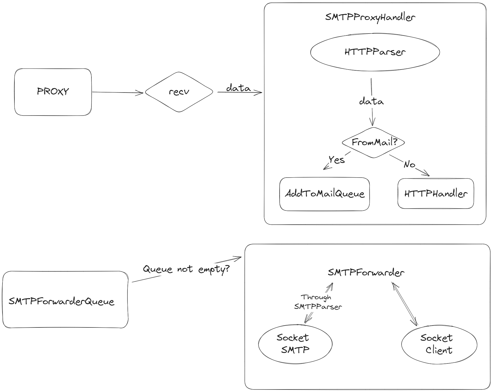
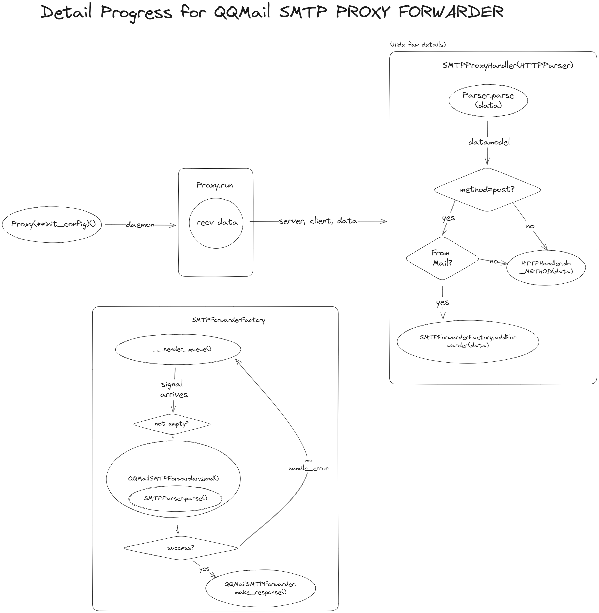

# BUPT-Computer-Networking-SMTP-Proxy

一个应付 21-BUPT-Computer-Networking 的实验。
使用 socket 编程实现一个 SMTP 代理

## Feature
- 基本的透明代理
- 特定站点的 SMTP 代理

## How it works



## How to run

```sh
git clone https://github.com/Nova-Noir/BUPT-Computer-Networking-SMTP-Proxy.git
cd BUPT-Computer-Networking-SMTP-Proxy
pip install pdm
python -m pdm install

# edit your config

python -m pdm run start
```

## Configs
```sh
cp .env.example .env
vim .env # or nano, or code, whatever you want.
```

config
```yaml
HOST = '0.0.0.0'  
PORT = 11567


# Log
LOG_LEVEL = 'INFO'
LOG_SAVE_PATH = 'logs'


# QQ SMTP
QQ_MAIL_POST_URL = '/cgi-bin/compose_send'
QQ_MAIL_WEBSERVER = 'mail.qq.com'

ACCOUNTS = 'qq;10001@qq.com;114514;smtp.qq.com;25'
# type;username;password;smtp;smtp_port type;username;password;smtp;smtp_port
```